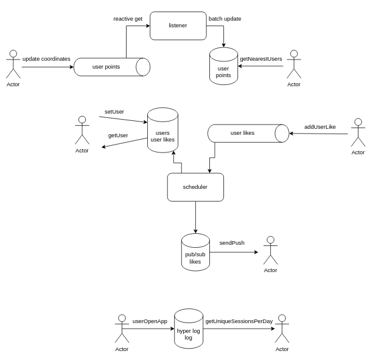

Here is example of using different Redis abilities.

Example of using `geo operations` you can find [here](./src/main/kotlin/com/example/redisdemo/service/UserGeoService.kt).

Example of using `hash operations` you can find [here](./src/main/kotlin/com/example/redisdemo/service/UserService.kt).

Example of using `list operations` you can find [here](./src/main/kotlin/com/example/redisdemo/service/UserLikeService.kt).

Example of using `stream operations` you can find [here](./src/main/kotlin/com/example/redisdemo/service/UserPointProducer.kt).

Example of using `pub sub` you can find [here](./src/main/kotlin/com/example/redisdemo/service/UserLikePushService.kt).

Example of using `hyper log log` you can find [here](./src/main/kotlin/com/example/redisdemo/service/UsersActivityService.kt).

The whole scheme of using method examples looks like that:

